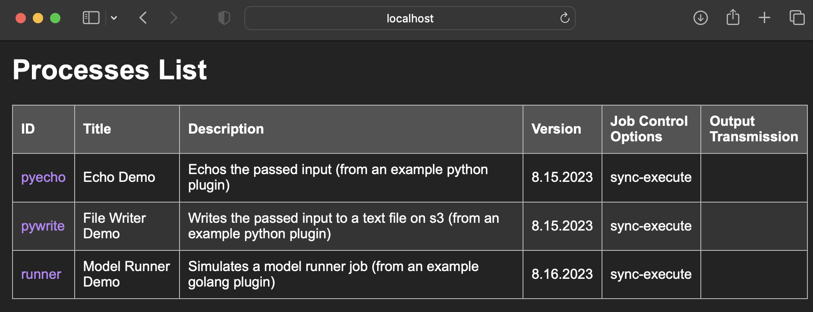
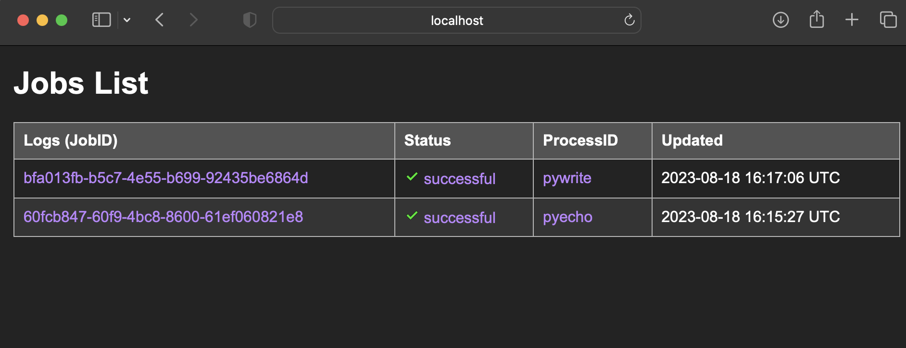
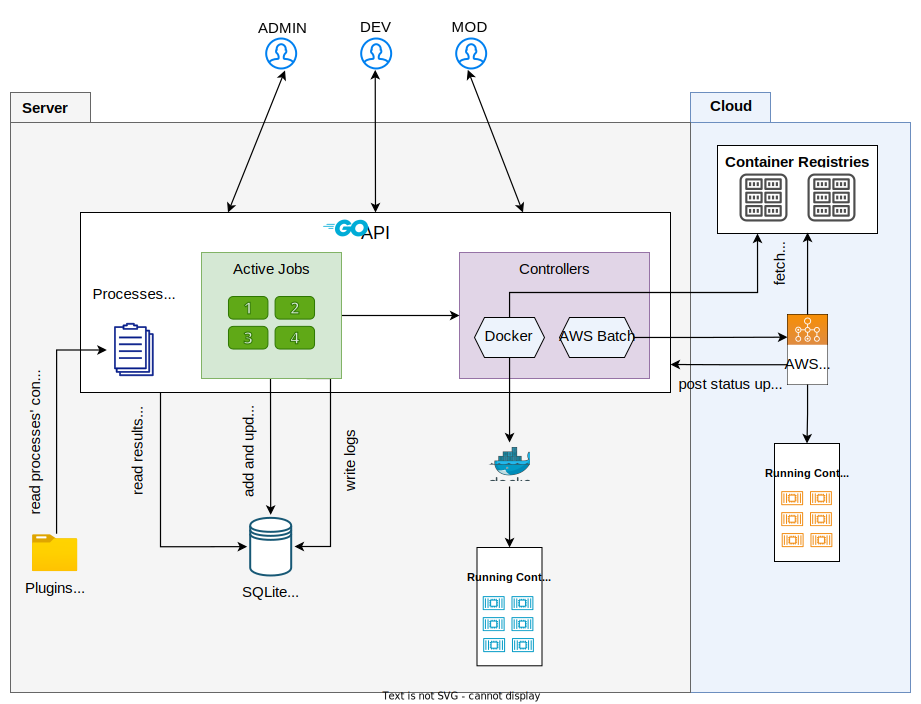
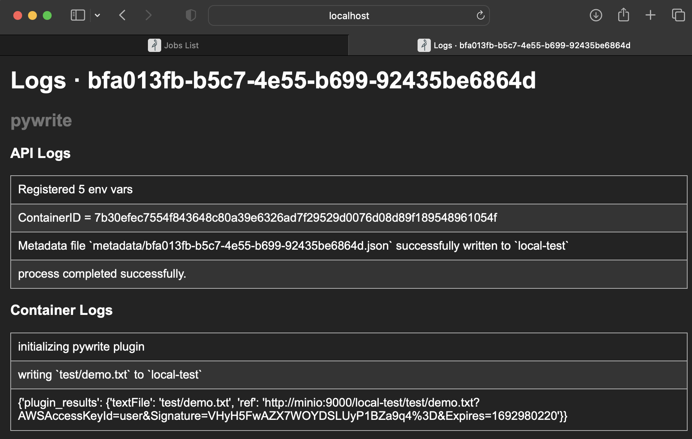
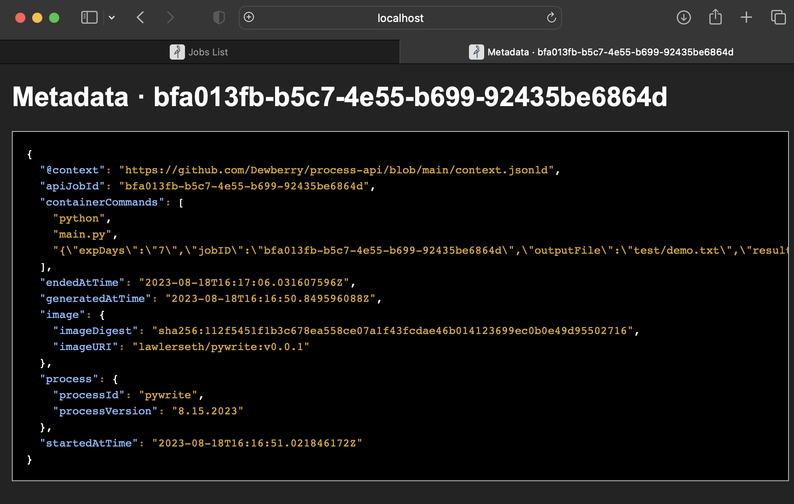

# process-api

[](https://github.com/Dewberry/process-api/actions/workflows/e2e-tests.yml)

A lightweight, extensible, OGC compliant Process API for local and cloud based containerized processing.

For more information on the specification visit the [OGC API - Processes - Part 1: Core](https://docs.ogc.org/is/18-062r2/18-062r2.html#toc0).

The API responses follow the examples provided here:
https://developer.ogc.org/api/processes/index.html

---

## Getting Started

1. Create docker network `docker network create process_api_net`

1. Build docker images for example plugins
```sh
cd plugin-examples &&
chmod +x build.sh &&
./build.sh &
```
1. Create a `.env` file (example below) at the root of this repo.

1. Add process configuration file(s) (yaml) to the [plugins](plugins/) directory
1. run `docker compose up`
1. Create a bucket in the minio console (http://localhost:9001).
1. Test endpoints using the swagger documentation page. (http://localhost:5050/swagger/index.html)


*API docs created using [swaggo](https://github.com/swaggo/swag)*

---

## System Components

The system design consists of four major system components:

### API
The API is the main orchestrator for all the downstream functionality and a single point of communication with the system.

### Processes

Processes are computational tasks described through a configuration file that can be executed in a container. Each configuration file contains information about the process such as the title of this process, its description, execution mode, execution resources, secrets required, inputs, and outputs. Each config file is to be unmarshalled to register a process in the API. These processes then can be called several times by the users to run jobs.


### Jobs

Each execution of a process is called a job. A job can be synchronous or asynchronous depending on which host it is being executed upon. Synchronous jobs return responses after the job has reached a finished state, meaning either successful or failed. The asynchronous jobs return a response immediately with a job id for the client so that the client can monitor the jobs.

*Note on Procesess: The developers must make sure they choose the right platform to execute a process. The processes that are short-lived and fast and do not create a file resource as an output, for example getting the water surface elevation values for a coordinate from cloud raster, must be registered to run on the local machine so that they are synchronous. These kinds of processes should output data in JSON format.*

*On the other hand, processes that take a long time to execute and their results are files, for example clipping a raster, must be registered to run on the cloud so that they are asynchronous. These processes should contain links to file resources in their results.*

### Execution Platforms
Execution platforms are hosts that can provide resources to run a job. The This can be a cloud provider such as AWS Batch or the local machine.


## Behaviour



At the start of the app, all the `.yaml` `.yml` (configuration) files are read and processes are registered. Each file describes what resources the process requires and where it wants to be executed. There are two execution platforms available; local processes run in a docker container, hence they must specify a docker image and the tag. The API will download these images from the repository and then run them on the host machine. Commands specified will be appended to the entrypoint of the container. The API responds to the request of local processes synchronously.

Cloud processes are executed on the cloud using a workload management service. AWS Batch was chosen as the provider for its wide user base. Cloud processes must specify the provider type, job definition, job queue, and job name. The API will submit a request to run the job to the AWS Batch API directly.

The containerized processes must expect a JSON load as the last argument of the entrypoint command and write results as the last log message in the format `{"plugin_results": results}`. It is the responsibility of the process to write these results correctly if the process succeeds. The API will store logs of the container and will try to parse the last log for results when the client requests results for jobs.

When a job is submitted, a local container is fired up immediately for sync jobs, and a job request is submitted to the AWS batch for async jobs. When a local job reaches a finished state (successful or failed), the local container is removed. Similarly, if an active job is explicitly dismissed using DEL route, the job is terminated, and resources are freed up. If the server is gracefully shut down, all currently active jobs are terminated, and resources are freed up.

The API responds to all GET requests (except `/jobs/<jobID>/results`) as HTML or JSON depending upon if the request is being originated from Browser or not or if it specifies the format using query parameter ‘f’.

### Logs

Logs are not included in the OGC-API Prcoesses specification, however for this implementation we have added logs to provide information on the API and Containers.

### Metadata

Similar to logs, metadata is not included in the OGC-API Prcoesses specification. We have added metadata as an endpoint to provide information on the version of the pliugin, the runtime, and the input arguments passed to the container at runtime. Metadata is generated for only successful jobs.

## Example .env file

An env file is required and should be available at the root of this repository (`./.env`). See the [example.env](example.env) for a guide.

## Notes
*NOTE: This server was adapted for ogc-compliance from an existing api developed by @albrazeau*